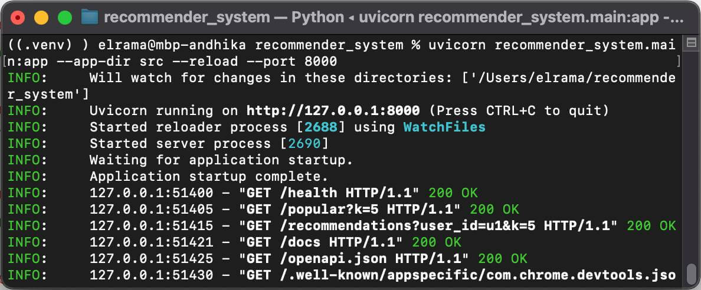
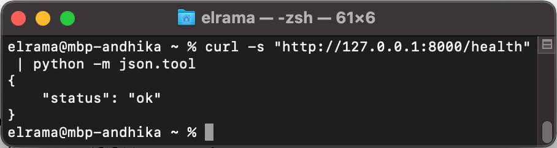
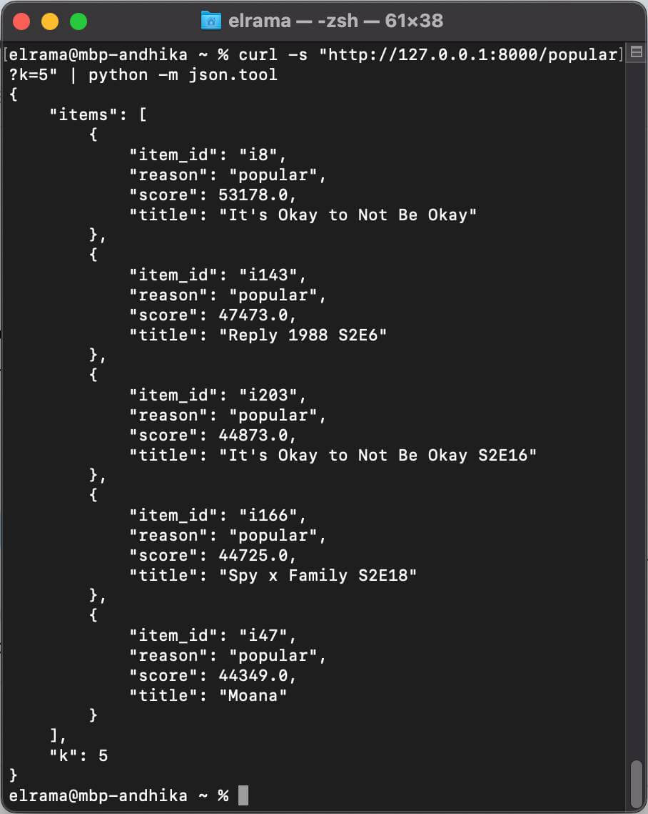
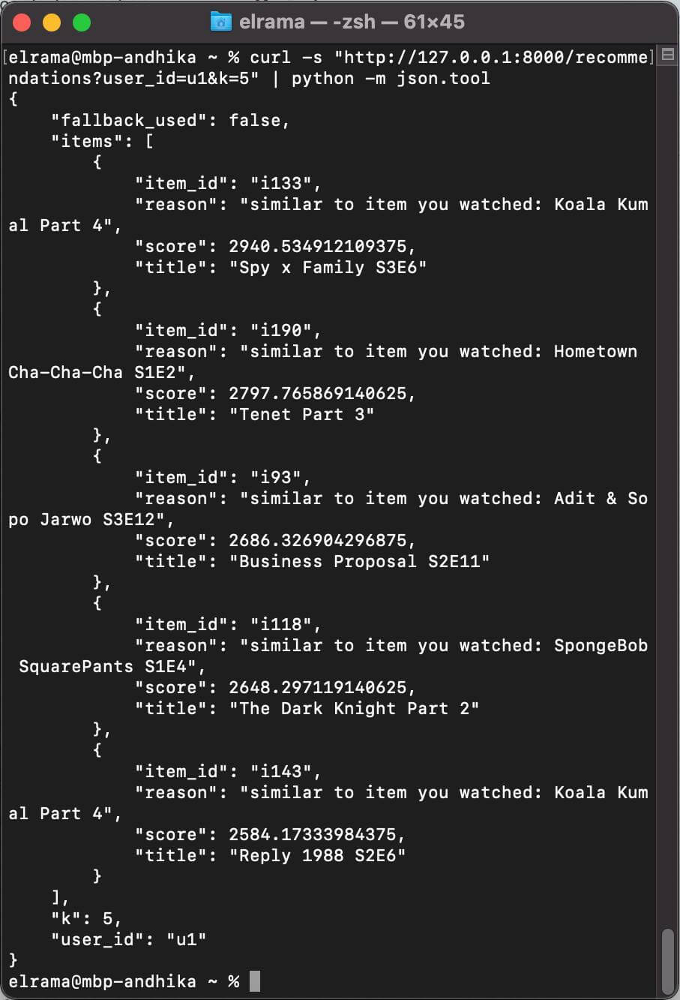
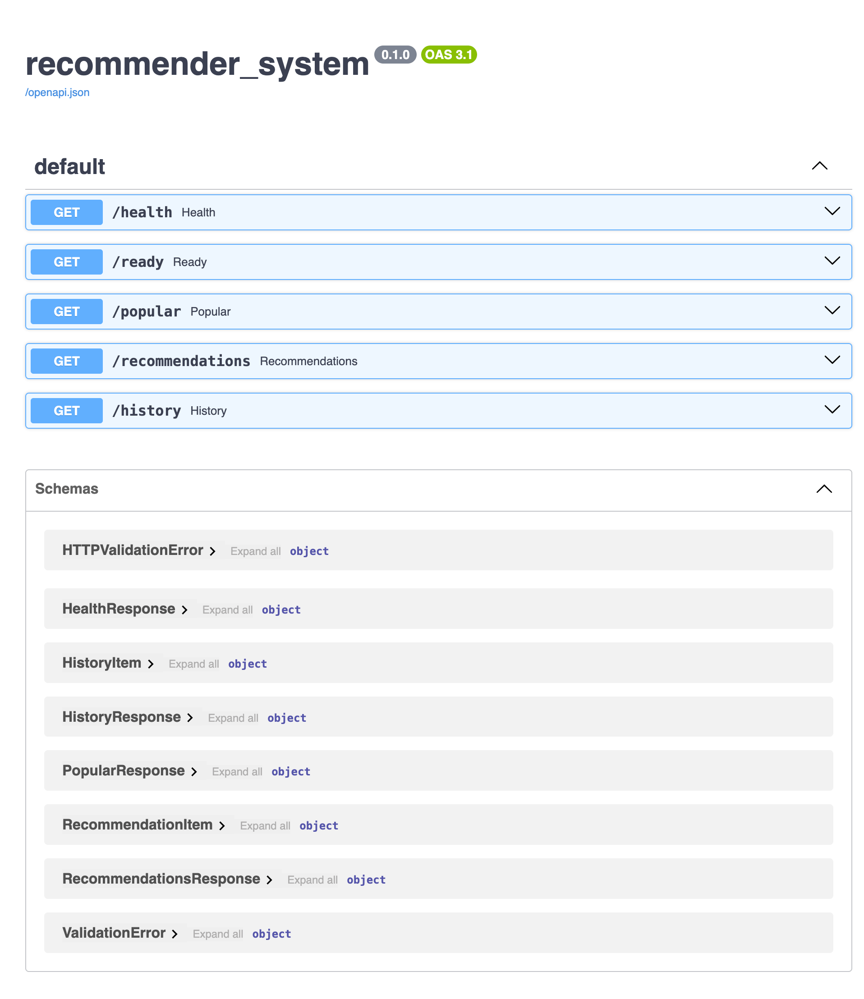

# Recommender System


A small working recommendation service for a streaming platform, built for a technical test.

**Core approaches**
- **Global Popularity**: ranks items by total `watch_seconds`
- **Personalized (Item-based CF)**: item–item cosine similarity from a user–item `watch_seconds` matrix
- **Reason (nice-to-have)**: simple explanation for each recommendation
- **Filters (nice-to-have)**: filter by `content_type` and/or `genre`
- **History (nice-to-have)**: user watch history summary endpoint

---

## Table of Contents
- [Project Structure](#project-structure)
- [Dataset](#dataset)
- [Quickstart](#quickstart)
- [Configuration](#configuration)
- [API Endpoints](#api-endpoints)
  - [/health](#get-health)
  - [/ready](#get-ready)
  - [/popular](#get-popular)
  - [/recommendations](#get-recommendations)
  - [/history](#get-history)
- [Recommendation Logic](#recommendation-logic)
- [Limitations](#limitations)
- [Future Improvements](#future-improvements)
- [Screenshots](#screenshots)

---

## Project Structure

> Note: Git does not track empty folders. If `tests/` or `data/processed/` are empty in your repo,
> either remove them from this tree or add a placeholder file (e.g., `.gitkeep`) so they appear on GitHub.

```txt
recommender_system/
├─ src/
│  └─ recommender_system/
│     ├─ __init__.py
│     ├─ config.py
│     ├─ recommender.py
│     ├─ main.py
│     └─ data/
│        ├─ __init__.py
│        └─ data_loader.py
├─ data/
│  ├─ raw/
│  │  ├─ users.csv
│  │  ├─ items.csv
│  │  └─ events.csv
│  └─ processed/         # optional placeholder (empty)
├─ tests/                # optional placeholder (empty)
└─ requirements.txt
````

---

## Dataset

Place the CSV files under `data/raw/`:

* `users.csv`: `user_id, name, age, gender, region`
* `items.csv`: `item_id, title, content_type, genre`
* `events.csv`: `user_id, item_id, event_type, watch_seconds, timestamp`

Assumptions:

* `watch_seconds` is used as implicit feedback strength.
* Data is small enough to fit in memory.

---

## Quickstart

### 1) Create venv & install dependencies

```bash
python -m venv .venv
# Windows: .venv\Scripts\activate
source .venv/bin/activate

pip install -r requirements.txt
```

### 2) Run the API

From the project root:

```bash
uvicorn recommender_system.main:app --app-dir src --reload --port 8000
```

Swagger UI:

* `http://127.0.0.1:8000/docs`

---

## Configuration

### Override raw data directory (optional)

```bash
export DATA_RAW_DIR="/absolute/path/to/recommender_system/data/raw"
```

---

## API Endpoints

### GET `/health`

Liveness probe (service is running).

Response:

```json
{"status":"ok"}
```

### GET `/ready`

Readiness probe (data/model loaded successfully).

* Returns `200` when ready
* Returns `503` with error details if startup loading failed

Example error:

```json
{"status":"error","detail":"FileNotFoundError: ..."}
```

### GET `/popular`

Global popularity recommendations.

Query params:

* `k` (default `10`)
* `content_type` (optional): `tv`, `movie`, `series`, `microdrama`, ...
* `genre` (optional): `drama`, `family`, `romance`, ...

Example:

```bash
curl -s "http://127.0.0.1:8000/popular?k=5&content_type=movie" | python -m json.tool
```

Response example:

```json
{
  "k": 5,
  "items": [
    {"item_id":"i47","title":"Moana","score":44349.0,"reason":"popular"}
  ]
}
```

### GET `/recommendations`

Personalized recommendations for a user (falls back to popular for cold start).

Query params:

* `user_id` (required)
* `k` (default `10`)
* `content_type` (optional)
* `genre` (optional)

Behavior:

* If user not found / no history → `fallback_used=true` and returns popular items
* Otherwise → item-based CF (`fallback_used=false`)
* Items watched heavily by the user (default `> 600` seconds) are excluded
* If personalized results < `k`, the list is topped up with popular items

Example:

```bash
curl -s "http://127.0.0.1:8000/recommendations?user_id=u1&k=5&genre=romance" | python -m json.tool
```

Response example:

```json
{
  "user_id": "u1",
  "k": 5,
  "fallback_used": false,
  "items": [
    {
      "item_id": "i93",
      "title": "Business Proposal S2E11",
      "score": 2686.32,
      "reason": "similar to item you watched: Adit & Sopo Jarwo S3E12"
    }
  ]
}
```

### GET `/history`

Returns a simple watch history summary for a user.

Query params:

* `user_id` (required)
* `k` (default `20`)

Example:

```bash
curl -s "http://127.0.0.1:8000/history?user_id=u1&k=10" | python -m json.tool
```

Response example:

```json
{
  "user_id": "u1",
  "k": 10,
  "items": [
    {"item_id":"i37","title":"Money Heist","watch_seconds":77,"timestamp":"2025-02-26T14:06:00"}
  ]
}
```

---

## Recommendation Logic

### Global Popularity

1. Compute `sum(watch_seconds)` per `item_id`
2. Sort descending and return top-k
3. Adds `reason="popular"`

### Item-based Collaborative Filtering (Cosine Similarity)

1. Build a user–item matrix from `sum(watch_seconds)` per `(user_id, item_id)`
2. Compute item–item cosine similarity
3. For a user:

   * score = `similarity_matrix @ user_vector`
4. Exclude items watched heavily by the user (default `> 600` seconds)
5. If results < `k`, top up with popular items

### Reason (nice-to-have)

* Personalized items: pick the most similar watched item as a “seed”

  * `reason = "similar to item you watched: <seed_title>"`
* Popular/fallback items:

  * `reason = "popular"`

---

## Limitations

* Uses only implicit feedback (`watch_seconds`) without weighting by `event_type`.
* Full similarity matrix is suitable for small datasets; not optimized for very large scale.
* No offline evaluation (precision@k/recall@k) or online A/B testing.
* Minimal API (no auth/rate limiting).

---

## Future Improvements

* Weight signals by `event_type` (e.g., `play`, `complete`, `like`).
* Normalize user vectors (log scaling / TF-IDF-like weighting).
* Add alternative models (user-based CF, matrix factorization).
* Add caching and optimize memory/compute.
* Add `pytest` unit tests (recommender + API).
* Add Docker support for reproducible runs.

---

## Quick Test (curl)

```bash
curl -s "http://127.0.0.1:8000/health"; echo
curl -i -s "http://127.0.0.1:8000/ready"; echo

curl -s "http://127.0.0.1:8000/popular?k=5" | python -m json.tool
curl -s "http://127.0.0.1:8000/popular?k=5&genre=drama" | python -m json.tool

curl -s "http://127.0.0.1:8000/recommendations?user_id=u1&k=5" | python -m json.tool
curl -s "http://127.0.0.1:8000/recommendations?user_id=u9999&k=5" | python -m json.tool

curl -s "http://127.0.0.1:8000/history?user_id=u1&k=10" | python -m json.tool
```

## Screenshots

### Server running


### Health


### Popular


### Recommendations


### Swagger UI
